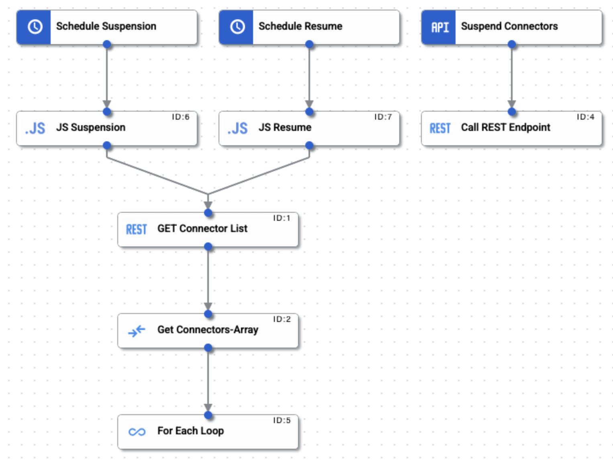

# CostGuard
 

Now that Application Integration is in General Availability, it will now generate a cost on your billing account. Therefore, it is very important to control the cost of connectors. That is why I want to share an integration pattern that will allow you to activate connectors during business hours and stop them outside of business hours in a very simple way through the programmable trigger. This pattern must be deployed in the region or regions where your connectors are enabled.

Important notes: You need to create an AuthProfile to execute the APIs of Integration Connectors, no problem I created a video including troubleshooting.

YouTube: https://www.youtube.com/watch?v=KWUI8fUodAc

